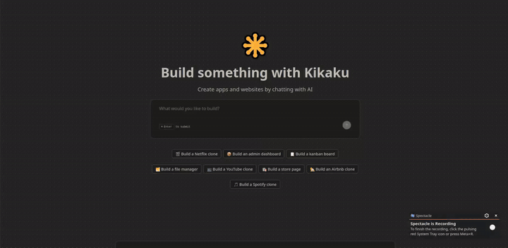

# Kikaku 🎯

> _A modern AI-powered platform that lets you build full Next.js apps just by chatting — describe what you want, and Kikaku generates the code, runs it in a live sandbox, and returns a real-time preview._

## ✨ Introduction

**Kikaku** is a full-stack AI app builder inspired by tools like Bolt and v0. It is engineered with **Next.js 16 (App Router)** and **TypeScript**, featuring an intelligent coding agent powered by **Inngest Agent Kit + OpenAI GPT-4o** that writes files, installs packages, and runs terminal commands inside a live **E2B sandbox** — all triggered by a simple chat message.

### Why build this project?

- 🎯 **AI-Native Architecture**: A multi-step agent loop runs inside Inngest, using tools (`terminal`, `createOrUpdateFile`, `readFiles`) to autonomously build Next.js apps inside an isolated E2B sandbox.
- ⚡ **Background Job Execution**: Long-running AI tasks are offloaded to Inngest functions, keeping the frontend responsive while the agent works asynchronously.
- 🔐 **Auth & Access Control**: Clerk handles authentication and plan detection (Free vs Pro). Rate limiting is enforced server-side via `rate-limiter-flexible` backed by PostgreSQL.
- 📡 **Type-Safe API**: End-to-end type safety with tRPC v11 + TanStack Query, including server-side prefetching and `HydrationBoundary` for zero loading flicker.
- 📱 **Responsive UI**: Resizable split-panel layout with a chat panel and a live preview/code explorer panel.

---

## 🛠️ Tech Stack

| Category            | Stack                                                 |
| ------------------- | ----------------------------------------------------- |
| **Framework**       | Next.js 16 (App Router, Server Components)            |
| **Language**        | TypeScript 5                                          |
| **Runtime**         | Node.js >= 20.19.0, React 19                          |
| **Auth**            | Clerk v6 (Sign In / Sign Up / Pricing Table)          |
| **Database**        | PostgreSQL + Prisma 7 + `@prisma/adapter-pg`          |
| **Background Jobs** | Inngest v3                                            |
| **AI Agent**        | Inngest Agent Kit v0.13 + OpenAI GPT-4o / GPT-4o-mini |
| **Code Sandbox**    | E2B Code Interpreter v2                               |
| **API Layer**       | tRPC v11 + TanStack Query v5                          |
| **UI**              | Tailwind CSS v4, shadcn/ui, Radix UI, Lucide Icons    |
| **Rate Limiting**   | rate-limiter-flexible v9 (Prisma adapter)             |
| **Forms**           | React Hook Form v7 + Zod v4                           |
| **Utilities**       | superjson, date-fns v4, sonner, next-themes           |

---

## 🦄 Features

- **💬 AI Chat Interface**: Send a prompt describing what you want to build; the AI agent autonomously generates a full Next.js app.
- **🤖 Multi-Tool Agent**: The agent can run shell commands, create/update files, and read existing files in the sandbox in a loop (up to 15 iterations).
- **🖥️ Live Preview**: An iframe renders the running Next.js app directly from the E2B sandbox URL.
- **🗂️ Code Explorer**: Browse and view all generated files in a resizable file tree with syntax highlighting (Prism.js).
- **📁 Project Management**: Create, list, and revisit past projects. Each project stores its full chat history and generated fragments.
- **💳 Credit System**: Free plan (2 generations / 30 days) and Pro plan (100 generations / 30 days) enforced server-side.
- **🌙 Dark Mode**: Full dark mode support via `next-themes`, applied to both the app UI and Clerk components.
- **⌨️ Prompt Templates**: 8 built-in project templates (Netflix clone, Kanban board, Spotify clone, etc.) for quick start.
- **📊 Usage Display**: Real-time credit counter with reset timer shown above the message input.

---

## 🤖 AI Agent Architecture

The AI Copilot is powered by an **Inngest background function** using **Inngest Agent Kit**, running a multi-agent network with OpenAI models.

```
User submits prompt (tRPC mutation)
    ↓ inngest.send("code-agent-kikaku/run")
Inngest CodeAgentFunction
    ↓ Sandbox.create (E2B)
    ↓ Load last 5 messages from DB
    ↓ createNetwork → agent loop (max 15 iterations)
        ├── terminal tool       → sandbox.commands.run(command)
        ├── createOrUpdateFile  → sandbox.files.write(path, content)
        └── readFiles           → sandbox.files.read(path)
    ↓ <task_summary> detected → exit loop
    ↓ fragmentTitleGenerator (GPT-4o-mini) → 3-word title
    ↓ responseGenerator (GPT-4o-mini)      → 1–3 sentence reply
    ↓ Save Message + Fragment to DB (Prisma)
Frontend polling (every 5s) → renders result
```

---

## 🔐 Auth & Credit Flow

```
Every tRPC mutation
  → Clerk auth() → extract userId
  → isAuthed middleware → UNAUTHORIZED if no userId

consumeCredits() on each generation
  → Check Clerk plan → "pro" = 100 pts, free = 2 pts (per 30 days)
  → RateLimiterPrisma.consume(userId, 1)
  → If exhausted → throw TOO_MANY_REQUESTS → redirect /pricing
```

---

## 🗄️ Database Schema

```
Project ──< Message ──── Fragment

Usage  (rate limiting, keyed by userId)
```

- **Project**: A user's project with a generated slug name and many messages.
- **Message**: A USER or ASSISTANT message with type RESULT or ERROR.
- **Fragment**: The AI-generated output — sandbox URL, file tree (JSON), and title.
- **Usage**: Rate limiting store (`key` = userId, `points` consumed, `expire` timestamp).

---

## 🚀 Getting Started

### Prerequisites

- **Node.js** >= 20.19.0
- **npm** or **pnpm**
- **PostgreSQL** database
- **Clerk** account (for auth + plan management)
- **OpenAI** API key
- **Inngest** account (or run locally with `inngest-cli`)
- **E2B** account (for sandbox)

### Installation

**1. Clone repository**

```bash
git clone https://github.com/Hieuej147/Kikaku-ui-agent.git
cd kikaku
```

**2. Install dependencies**

```bash
npm install
```

**3. Setup environment variables**

Create `.env.local` in the root:

```env
# Database
DATABASE_URL=url-your-database

# App URL
NEXT_PUBLIC_APP_URL=http://localhost:3000

# Clerk Auth
CLERK_SECRET_KEY=sk_...
NEXT_PUBLIC_CLERK_PUBLISHABLE_KEY=pk_...
NEXT_PUBLIC_CLERK_SIGN_IN_URL=/sign-in
NEXT_PUBLIC_CLERK_SIGN_UP_URL=/sign-up
NEXT_PUBLIC_CLERK_SIGN_IN_FALLBACK_REDIRECT_URL=/
NEXT_PUBLIC_CLERK_SIGN_UP_FALLBACK_REDIRECT_URL=/

# OpenAI
OPENAI_API_KEY=sk-...

# Inngest
INNGEST_EVENT_KEY=...
INNGEST_SIGNING_KEY=...

# E2B Sandbox
E2B_API_KEY=e2b_...
```

**4. Migrate database**

```bash
npx prisma migrate dev
```

**5. Start dev server**

```bash
npm run dev
```

**6. Start Inngest dev server** (separate terminal)

```bash
npx inngest-cli@latest dev
```

App runs at: **http://localhost:3000**

---

## 📖 Available Scripts

```bash
npm run dev        # Start dev server (Next.js)
npm run build      # Build for production
npm run start      # Start production build
npm run lint       # Run ESLint
# postinstall runs automatically: prisma generate
```

---

## 🐳 E2B Sandbox

The sandbox is a pre-built Next.js 16 environment running inside Docker on E2B infrastructure:

- **Base image**: `node:24-slim`
- **Pre-installed**: `create-next-app`, all Shadcn UI components, Tailwind CSS + PostCSS
- **Dev server**: Already running on port 3000 with hot reload — the AI never restarts it
- **Template name**: `kikaku-nextjs-hieu-bc-v2`
- **Timeout**: 30 minutes per session

---

## 💳 Plans & Credits

| Plan        | Credits         | Period  |
| ----------- | --------------- | ------- |
| Free        | 2 generations   | 30 days |
| Pro (Clerk) | 100 generations | 30 days |

When credits are exhausted, users are redirected to `/pricing`.

---

## 🔄 What I Learned

- **Inngest Agent Kit**: Building multi-tool agent networks with persistent state, lifecycle hooks, and router-controlled iteration loops.
- **E2B Sandbox**: Managing sandbox lifecycle (create, connect, timeout), writing/reading files, and streaming terminal output.
- **tRPC v11 + TanStack Query**: Server-side prefetching with `HydrationBoundary`, type-safe mutations with cache invalidation.
- **Clerk plan-based access**: Using `has({ plan: "pro" })` server-side for rate limiting and client-side for UI gating.
- **Background job patterns**: Decoupling long-running AI tasks from the HTTP request lifecycle using event-driven Inngest functions.

---

## 🎬 Demo



---

## 📝 License

This project is **UNLICENSED** — for educational and portfolio purposes.

---

## 👨‍💻 Author

**Hieu Dev**

- GitHub: [@Hieuej147]( GitHub: [@Hieuej147](https://github.com/Hieuej147))

---

<div align="center">
  <sub>Built with ❤️ using Next.js, Inngest Agent Kit, and E2B</sub>
</div>
